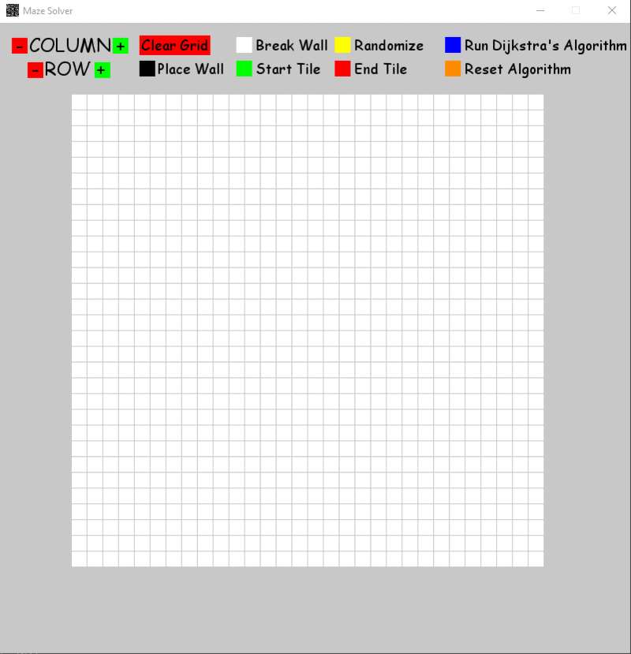

# maze-solver project

A visualization of Dijkstra's algorithm using a grid interface!

Create a maze (or any series of obstacles between the start and end cells) and 
run Dijkstra's algorithm to see the steps it takes and the final path (if one exists).

